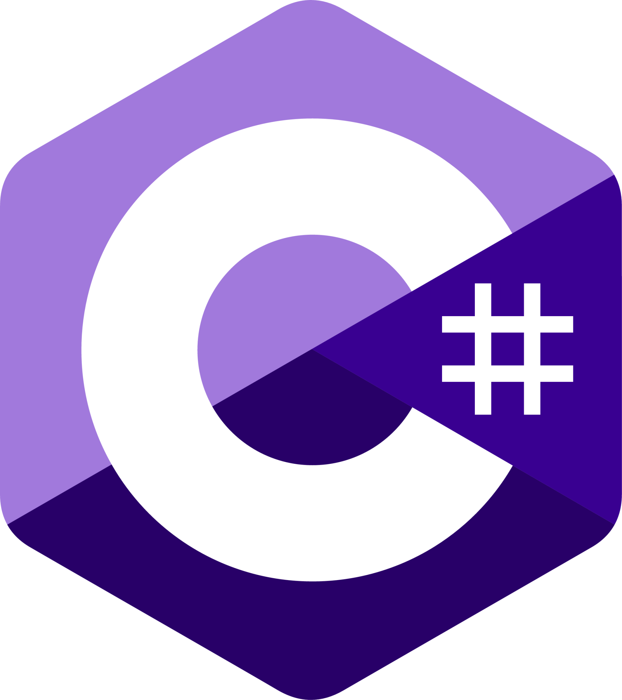
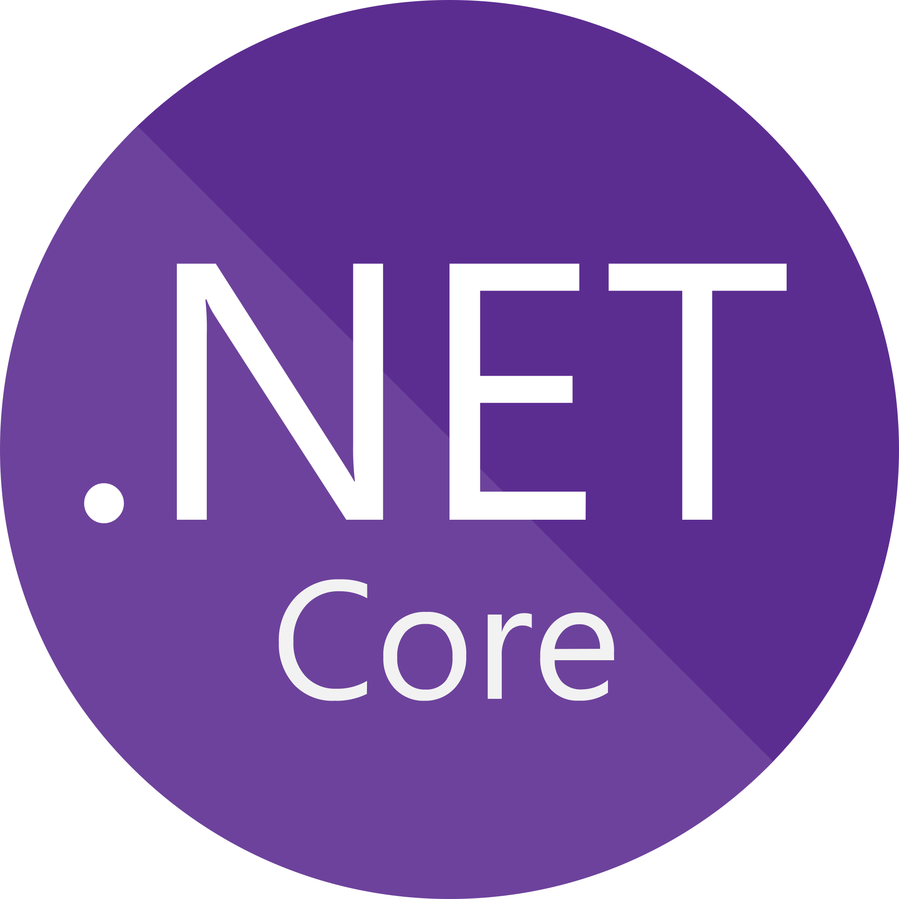
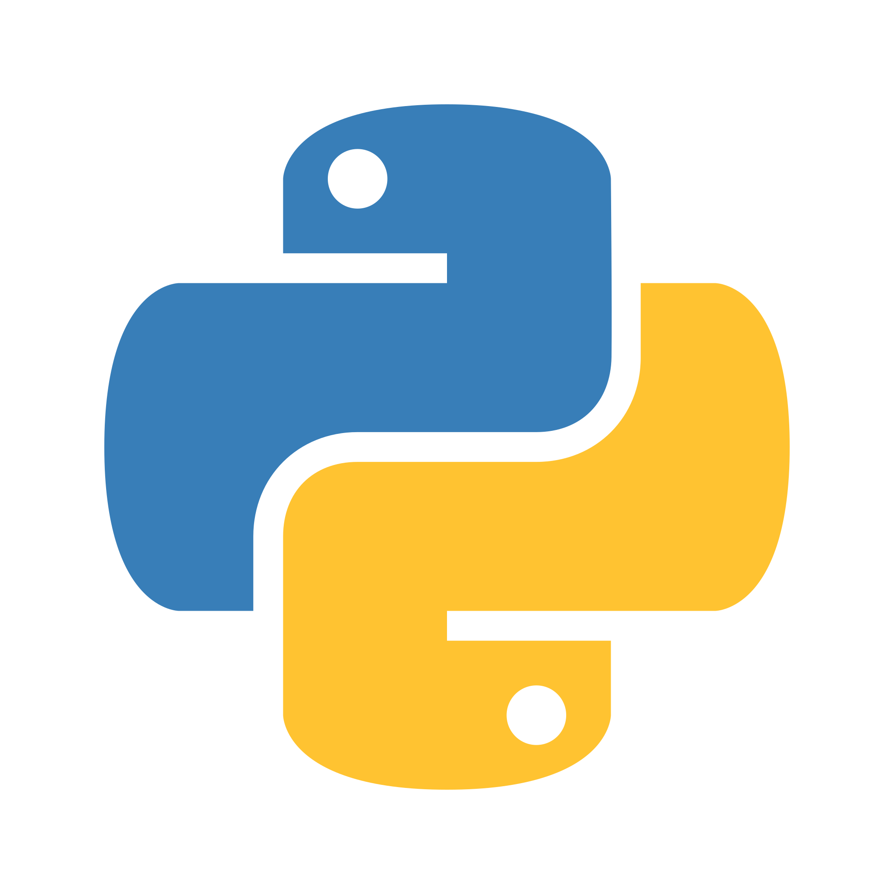
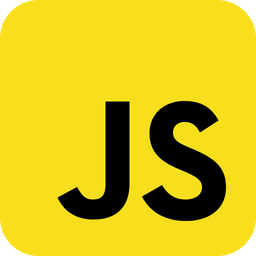
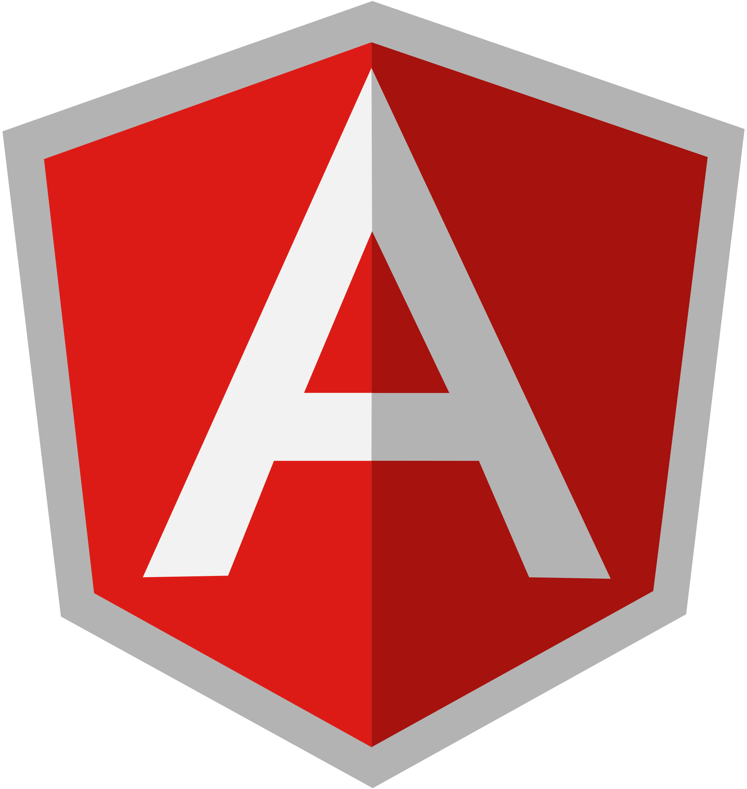
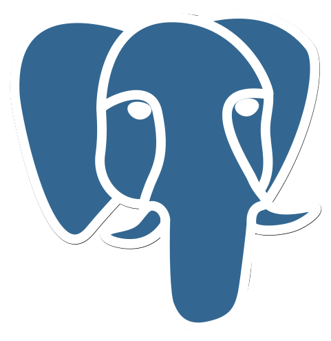
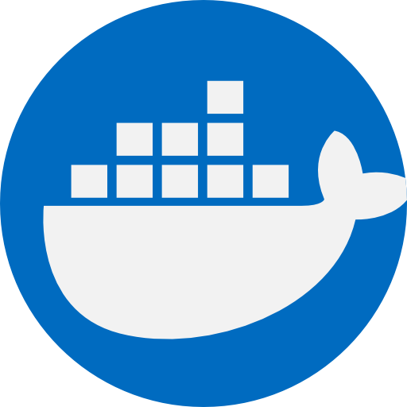
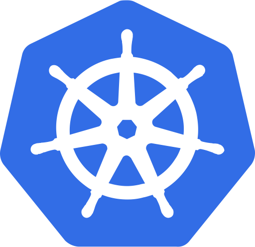
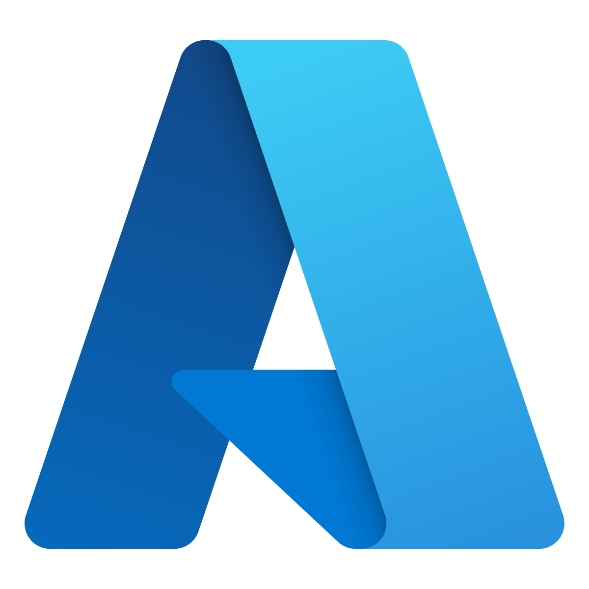

# Hi, I’m Daniel Nagami 👋

I’m a software engineer in São Paulo, Brazil, currently working at **Stefanini**. My focus is on applying AI to build useful, dependable software—supported by a foundation in backend development, cloud-ready systems, and thoughtful engineering practices.

## About me

- 🏢 Software engineer at **Stefanini**, based in São Paulo, Brazil.
- 🤖 Focused on applying AI to real-world products, including LLM-powered experiences and multi-agent solutions.
- ⚙️ Building reliable applications and APIs with **C#**, **.NET**, **Python**, cloud platforms, and relational or document databases.
- 🧠 Interested in software architecture, clean code, and engineering practices that make AI solutions dependable in production.
- 🎓 B.S. in Computer Science from Universidade Paulista (UNIP).

## Technology toolbox

  
  
  
  
  
  
  
  
  
  
  
  
  
  
  
  

## Selected projects

- [**Nerd Store Enterprise**](https://github.com/danielnagami/nerd-store-enterprise) — an enterprise application built while studying ASP.NET Core architecture patterns.
- [**Queridometro**](https://github.com/danielnagami/queridometro) — a C# application inspired by the Big Brother Brasil popularity meter.
- [**Homie**](https://github.com/danielnagami/homie) — a mobile-first, gamified household task app with live collaboration, achievements, and leaderboards.

## GitHub activity

  

Thanks for stopping by. Feel free to explore my work or connect with me on LinkedIn.
